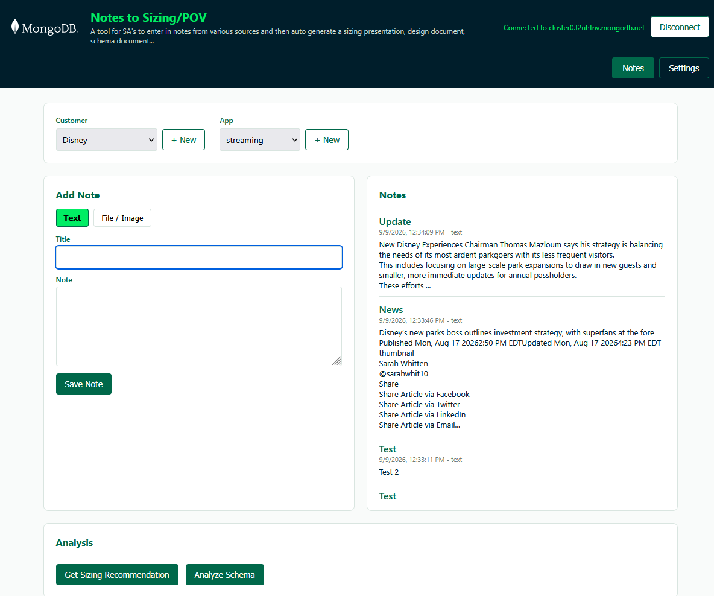

# Notes to Sizing/POV

**A tool for SA's to enter in notes from various sources and then auto generate a sizing presentation, design document, schema document...**

A single-user (per team), multi-customer web app for capturing engagement notes (text, files, images) per customer + app, and generating heuristic Atlas sizing recommendations and schema design findings from that data — output as copy-paste-ready text for use in decks/docs.



## Features

- **Customer → App → Notes hierarchy** — select or create a customer, then select or create an app for that customer, then capture notes scoped to that pair.
- **Text notes** — paste/type notes directly into the app, with editing, deleting, and a 10-line preview (expandable) for long notes.
- **File & image notes** — upload documents/images, stored in MongoDB Atlas via GridFS; images show as clickable thumbnails that expand to full size, and both the file and title can be edited (including replacing the underlying file) or deleted.
- **Sizing recommendation** — manual-input calculator (estimated data size, growth multiplier, index overhead) that recommends an Atlas cluster tier using configurable tier pricing; if no data size is provided, returns a list of discovery questions to ask the customer instead (full AI-based sizing from note content is planned but not yet implemented).
- **Schema design linting** — flags schema drift, oversized documents, missing indexes, and other design concerns found in a given app's notes; if fewer than 3 notes exist, returns data-modeling discovery questions to ask the customer instead.
- **Settings page** — edit Atlas tier pricing and global/per-customer discount percentages used in sizing calculations.

## Tech Stack

- Node.js + Express (backend API)
- MongoDB Atlas driver (`mongodb` npm package) + GridFS for file storage
- Plain HTML/CSS/vanilla JS frontend (no build step, no framework)
- `multer` for file upload handling
- No `.env`/config files required — the app asks for your Atlas connection details in-browser on first run (see **Portability** below)

## Architecture

### Multi-tenancy: database-per-customer, collection-per-app

```
Cluster
├── platform (database)
│   ├── customers (collection)
│   │   { name, dbSlug, discountPercent, apps: [{ name, appSlug, createdAt }], createdAt }
│   └── pricingConfig (collection, singleton doc "default")
│       { tiers: [...], discountPercent, updatedAt }
├── disney (database)                       # one database per customer
│   ├── mobile-app.notes                    # one collection per app
│   ├── mobile-app-uploads.files / .chunks  # GridFS bucket per app
│   ├── website.notes
│   └── website-uploads.files / .chunks
├── acme (database)
│   └── ... same pattern per its apps
```

This design keeps per-app sizing/schema analysis clean (native `collStats()`/`db.stats()` scoped exactly to one app's data) and keeps customer data cleanly isolated. At hackathon/team scale (dozen customers, up to ~40 apps each) this stays well within Atlas namespace limits on any dedicated (M10+) tier.

### Data model

**Note document** (in `<appSlug>.notes`):
```json
{
  "_id": "ObjectId",
  "title": "Meeting recap",
  "type": "text",
  "body": "Discussed Q3 roadmap...",
  "source": "manual",
  "externalId": null,
  "createdAt": "ISODate",
  "updatedAt": "ISODate"
}
```
File notes additionally include `fileId`, `filename`, `contentType`, `size` (and omit `body`).

**Customer registry** (in `platform.customers`):
```json
{
  "name": "Disney",
  "dbSlug": "disney",
  "discountPercent": null,
  "apps": [{ "name": "Mobile App", "appSlug": "mobile-app", "createdAt": "ISODate" }],
  "createdAt": "ISODate"
}
```

**Pricing config** (in `platform.pricingConfig`, singleton doc `_id: "default"`):
```json
{
  "_id": "default",
  "tiers": [
    { "tier": "M10", "ramGB": 2, "storageGB": 10, "vCPUs": 2, "monthlyPrice": 58.4 }
  ],
  "discountPercent": 0,
  "updatedAt": "ISODate"
}
```
Seeded from real public Atlas pricing (mongodb.com/pricing) on first server start.

## Folder Structure

```
.
├── run.sh                    # one-step start script (Mac/Linux): npm install && npm start
├── start.bat                 # one-step start script (Windows)
├── server.js                 # Express app entry point
├── db.js                     # dynamic Mongo connection, per-customer/app db/collection/bucket helpers, pricingConfig seeding
├── middleware.js              # requireConnection guard for data routes
├── routes/
│   ├── connection.js          # connect/disconnect/status endpoints
│   ├── customers.js           # customer + app registry endpoints
│   ├── config.js              # pricing config endpoints
│   └── notes.js               # notes + file endpoints, scoped by customer/app
├── services/
│   ├── sizingAnalyzer.js      # heuristic Atlas tier estimator
│   └── schemaLinter.js        # schema design lint checks
├── public/
│   ├── assets/mongodb-logo.svg
│   ├── index.html
│   ├── style.css
│   └── script.js
└── package.json
```

## Setup & Run (Portability)

This app is designed to be **extracted into a folder and run with zero config file editing** — ideal for hackathon judges or new teammates.

1. Get the code and open a terminal in that folder:
   ```
   git clone https://github.com/SlothWorks247/tsunami.git
   cd tsunami
   ```
   (or extract a zip of the repo instead of cloning, if that's how it was shared with you)
2. Run the start script:
   - **Mac/Linux:** `./run.sh`
   - **Windows:** double-click `start.bat` (or run it from a terminal)

   Either script just runs `npm install` followed by `npm start` — equivalent to running those two commands yourself if you'd rather do that.
3. Open [http://localhost:3000](http://localhost:3000).
4. On first run, you'll see a **Connect to MongoDB Atlas** screen asking for:
   - **Cluster Host** — e.g. `cluster0.xxxxx.mongodb.net` (no `mongodb+srv://` prefix, no embedded credentials)
   - **Username**
   - **Password**

   This project uses a **shared Atlas cluster** for the team — get these details from a teammate via a secure channel (Slack DM, password manager, etc.). Make sure your IP is allowed in the Atlas cluster's **Network Access** list (or ask whoever manages the cluster to add it / temporarily allow `0.0.0.0/0` for the hackathon).
5. The connection lives only in memory for as long as the server process is running — nothing is written to disk. If you restart the server or click **Disconnect** in the header, you'll need to re-enter your connection details.

## API Reference

| Method | Route | Description |
|---|---|---|
| GET | `/api/connection/status` | Check whether the app is currently connected to a database |
| POST | `/api/connection` | Connect `{ host, username, password }` — kept in memory only, not persisted |
| POST | `/api/connection/disconnect` | Disconnect from the current database |
| GET | `/api/customers` | List all customers |
| POST | `/api/customers` | Create a customer `{ name }` |
| PATCH | `/api/customers/:customerSlug` | Update a customer's `discountPercent` override |
| GET | `/api/customers/:customerSlug/apps` | List a customer's apps |
| POST | `/api/customers/:customerSlug/apps` | Create an app for a customer `{ name }` |
| GET | `/api/config/pricing` | Get tier pricing + global discount |
| PUT | `/api/config/pricing` | Replace tier pricing / global discount |
| GET | `/api/customers/:customerSlug/apps/:appSlug/notes` | List notes for a customer+app |
| POST | `/api/customers/:customerSlug/apps/:appSlug/notes` | Create a text note `{ title, body }` |
| POST | `/api/customers/:customerSlug/apps/:appSlug/notes/upload` | Upload a file/image note (multipart form, field `file`, optional `title`) |
| PUT | `/api/customers/:customerSlug/apps/:appSlug/notes/:noteId` | Edit a text note's `{ title, body }`, or rename a file note's title |
| PUT | `/api/customers/:customerSlug/apps/:appSlug/notes/:noteId/upload` | Replace a file note's underlying file (multipart form, field `file`, optional `title`) |
| DELETE | `/api/customers/:customerSlug/apps/:appSlug/notes/:noteId` | Delete a note (also deletes its GridFS file, if any) |
| GET | `/api/customers/:customerSlug/apps/:appSlug/files/:fileId` | Stream/download a file note's content |
| POST | `/api/customers/:customerSlug/apps/:appSlug/analysis/sizing` | Get a sizing recommendation from manual inputs `{ dataSizeGB, growthMultiplier, indexOverheadPercent }`, or a list of discovery questions if `dataSizeGB` is missing |
| GET | `/api/customers/:customerSlug/apps/:appSlug/analysis/schema` | Get schema design lint findings, or a list of discovery questions if fewer than 3 notes exist |

## Known Limitations / Explicitly Deferred (future work)

- **No authentication** — single-user-per-team app for now; anyone with the shared connection string/app URL has full access.
- **No real document/presentation file export** — sizing/schema outputs are presentation-ready *text* meant to be copy-pasted into slides/docs, not generated PPTX/DOCX/PDF files yet.
- **No Salesforce Notes integration yet** — the `source` and `externalId` fields exist on note documents specifically to make this easier to add later (dedupe/upsert by external ID), but no sync logic exists yet.
- **No Atlas Admin API integration** — sizing recommendations are heuristic, computed only from `collStats()`/`db.stats()` data already visible to the driver; no live cluster metrics or Performance Advisor integration.
- **Hand-written CSS, not MongoDB's official LeafyGreen UI** — styling approximates MongoDB's brand palette but isn't pixel-accurate to MongoDB's real design system. Migrating to LeafyGreen UI (React) later is possible without touching backend/API code.
