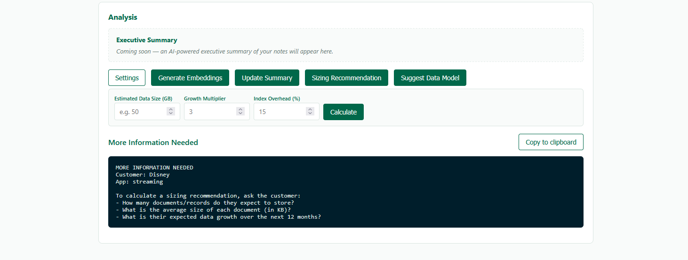
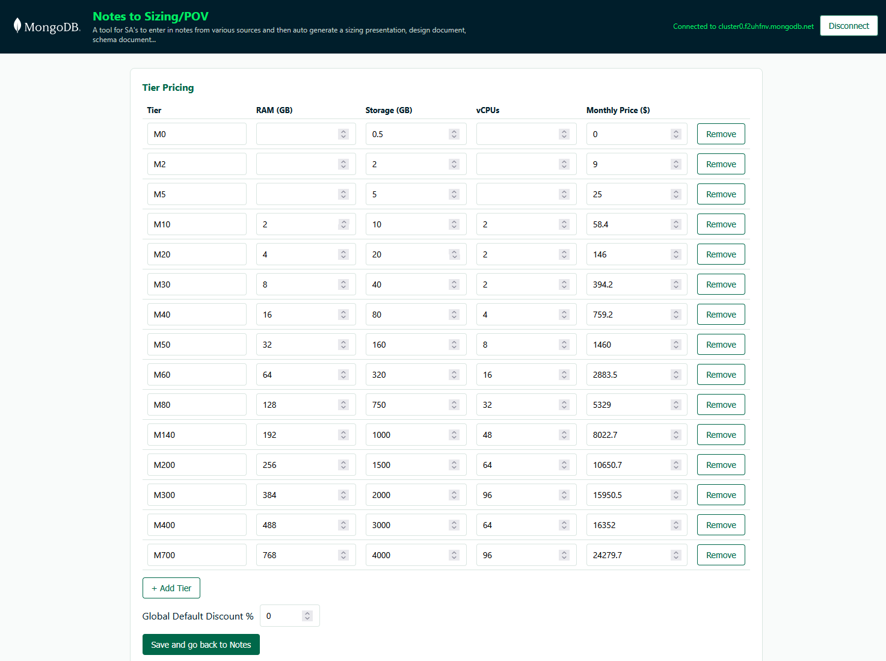

# Notes to Sizing/POV

**A tool for SA's to enter in notes from various sources and then auto generate a sizing presentation, design document, schema document...**

A multi-user, multi-customer web app for capturing engagement notes (text, files, images) per customer + app, chatting with an AI Assistant grounded in those notes, and generating heuristic Atlas sizing recommendations and schema design findings — output as copy-paste-ready text for use in decks/docs.






> **Note:** the screenshots above were captured before the AI Assistant, Skills, and the reorganized 5-section Settings page were added, so the current UI (especially Settings) looks somewhat different now.

## Features

- **Customer → App → Notes hierarchy** — select or create a customer, then select or create an app for that customer, then capture notes scoped to that pair.
- **Text notes** — paste/type notes directly into the app, with editing, deleting, and a 10-line preview (expandable) for long notes.
- **File & image notes** — upload documents/images, stored in MongoDB Atlas via GridFS; images show as clickable thumbnails that expand to full size, and both the file and title can be edited (including replacing the underlying file) or deleted. Text is automatically extracted from PDFs, Word docs (`.docx`), Excel/CSV (`.xlsx`), PowerPoint (`.pptx`), and images (via OCR) so it can be searched, chatted about, and embedded.
- **AI Assistant chat** — ask questions about a customer/app's notes; answers are grounded in the notes via retrieval-augmented generation (RAG). Two retrieval modes: **Smart** (Atlas Vector Search over embedded note chunks, falls back gracefully to Normal mode if unavailable) and **Normal** (stuffs all notes directly into context). Works with Ollama (local) or any OpenAI-compatible endpoint.
- **Executive Summary** — one-click AI-generated summary of all engagement notes for a customer/app (overview, data & workload, architecture, sizing considerations, open questions), using the same retrieval pipeline as chat.
- **Vector embeddings** — note text is automatically chunked and embedded (via MongoDB Atlas's Voyage AI embedding API) whenever a note is created or edited; a backfill endpoint/button re-embeds any notes that predate embeddings being configured, or that failed to embed. Atlas Vector Search indexes are created/maintained automatically per app.
- **Skills** — specialized instructions appended to the AI Assistant's system prompt. A `mongodb-schema-design` skill (patterns, anti-patterns, and decision frameworks for MongoDB data modeling) ships with the app and can be toggled on/off. Users can also paste or upload their own `SKILL.md`-style markdown skills for the current session.
- **Sizing recommendation** — manual-input calculator (estimated data size, growth multiplier, index overhead) that recommends an Atlas cluster tier using configurable tier pricing; growth multiplier and index overhead have saved defaults (editable in Settings) that pre-fill the calculator. If no data size is provided, returns a list of discovery questions to ask the customer instead (full AI-based sizing from note content is planned but not yet implemented).
- **Schema design linting** — flags schema drift, oversized documents, missing indexes, and other design concerns found in a given app's notes; if fewer than 3 notes exist, returns data-modeling discovery questions to ask the customer instead.
- **Settings page** — organized into 5 sections via a left-hand nav: **General Settings** (placeholder for now), **AI Model** (LLM provider/endpoint/model/API key + system prompt/rules), **Skills** (toggle the built-in skill, add your own), **Embeddings** (Voyage AI/Atlas API key + model), and **Sizing Settings** (Atlas tier pricing, global/per-customer discounts, sizing calculation defaults).

## Tech Stack

- Node.js + Express (backend API)
- MongoDB Atlas driver (`mongodb` npm package) + GridFS for file storage + Atlas Vector Search for embeddings
- `express-session` for session-scoped auth (Atlas credentials, AI provider config, and skills all live in-memory per session — nothing is written to disk)
- Plain HTML/CSS/vanilla JS frontend (no build step, no framework)
- `multer` for file upload handling; `mammoth`, `pdf-parse`, `xlsx`, `jszip`, `tesseract.js` for extracting searchable text from uploaded files (DOCX, PDF, XLSX, PPTX, and OCR for images, respectively)
- Ollama (local) or any OpenAI-compatible endpoint for the AI Assistant chat LLM; MongoDB Atlas's Voyage AI embedding API for vector search
- No `.env`/config files required to run — the app asks for your Atlas connection details and AI provider in-browser on first login (see **Portability** below). An optional `SESSION_SECRET` environment variable can be set for production use; a development fallback is used otherwise.

## Architecture

### Multi-tenancy: database-per-customer, collection-per-app

```
Cluster
├── platform (database)
│   ├── customers (collection)
│   │   { name, dbSlug, discountPercent, apps: [{ name, appSlug, createdAt }], createdAt }
│   └── pricingConfig (collection, singleton doc "default")
│       { tiers: [...], discountPercent, defaultGrowthMultiplier, defaultIndexOverheadPercent, updatedAt }
├── disney (database)                       # one database per customer
│   ├── mobile-app.notes                    # one collection per app
│   ├── mobile-app.note_chunks              # chunked + embedded note text, per app
│   ├── mobile-app-uploads.files / .chunks  # GridFS bucket per app
│   ├── website.notes
│   ├── website.note_chunks
│   └── website-uploads.files / .chunks
├── acme (database)
│   └── ... same pattern per its apps
```

This design keeps per-app sizing/schema analysis clean (native `collStats()`/`db.stats()` scoped exactly to one app's data) and keeps customer data cleanly isolated. At hackathon/team scale (dozen customers, up to ~40 apps each) this stays well within Atlas namespace limits on any dedicated (M10+) tier.

### Data model

**Note document** (in `<appSlug>.notes`):
```json
{
  "_id": "ObjectId",
  "title": "Meeting recap",
  "type": "text",
  "body": "Discussed Q3 roadmap...",
  "source": "manual",
  "externalId": null,
  "createdAt": "ISODate",
  "updatedAt": "ISODate"
}
```
File notes additionally include `fileId`, `filename`, `contentType`, `size`, and `textContent` (text extracted from the file for search/chat/embedding), and omit `body`.

**Note chunk document** (in `<appSlug>.note_chunks`, one or more per note):
```json
{
  "_id": "ObjectId",
  "noteId": "ObjectId",
  "chunkIndex": 0,
  "text": "[Note: Meeting recap]\nDiscussed Q3 roadmap...",
  "embedding": [0.012, -0.034, "... 1024 floats"],
  "embeddingModel": "voyage-4-lite",
  "createdAt": "ISODate"
}
```
Notes are split into ~2000-character overlapping chunks and embedded automatically on create/edit. An Atlas Vector Search index (`vector_index`, cosine similarity) is created/kept in sync per app based on the configured embedding model's dimensions.

**Customer registry** (in `platform.customers`):
```json
{
  "name": "Disney",
  "dbSlug": "disney",
  "discountPercent": null,
  "apps": [{ "name": "Mobile App", "appSlug": "mobile-app", "createdAt": "ISODate" }],
  "createdAt": "ISODate"
}
```

**Pricing config** (in `platform.pricingConfig`, singleton doc `_id: "default"`):
```json
{
  "_id": "default",
  "tiers": [
    { "tier": "M10", "ramGB": 2, "storageGB": 10, "vCPUs": 2, "monthlyPrice": 58.4 }
  ],
  "discountPercent": 0,
  "defaultGrowthMultiplier": 3,
  "defaultIndexOverheadPercent": 15,
  "updatedAt": "ISODate"
}
```
Seeded from real public Atlas pricing (mongodb.com/pricing) on first server start.

## Folder Structure

```
.
├── run.sh                    # one-step start script (Mac/Linux): checks deps, offers to install Ollama + pull the default model, then npm install && npm start
├── start.bat                 # one-step start script (Windows), same behavior as run.sh
├── server.js                 # Express app entry point, session setup, route mounting, graceful shutdown
├── db.js                     # dynamic per-session Mongo connections, per-customer/app db/collection/bucket helpers, pricingConfig seeding, session-expiry connection sweep
├── middleware.js              # requireAuth (session flag only) / requireDb (session + live Mongo client) guards
├── mongodb-schema-design/     # bundled default Skill: SKILL.md + references/*.md (patterns, anti-patterns, fundamentals)
├── routes/
│   ├── auth.js                # login/logout/session endpoints (Atlas credentials + AI provider + Voyage key, all session-scoped)
│   ├── customers.js           # customer + app registry endpoints
│   ├── config.js              # pricing/sizing config endpoints
│   ├── notes.js                # notes + file endpoints, embedding pipeline, backfill, sizing/schema analysis
│   ├── llm.js                  # LLM provider config, Ollama model listing, Voyage embeddings config/test
│   ├── chat.js                 # AI Assistant chat + executive summary endpoints (RAG)
│   └── skills.js               # default-skill toggle + session-scoped custom skills CRUD
├── services/
│   ├── sizingAnalyzer.js       # heuristic Atlas tier estimator
│   ├── schemaLinter.js         # schema design lint checks
│   ├── embeddings.js           # Voyage AI (Atlas) embedding API client
│   ├── chunker.js              # note text chunking for embeddings
│   ├── retrieval.js             # vector search + context-stuffing retrieval for chat/summary
│   ├── llm.js                   # OpenAI-compatible chat completion client
│   ├── fileParser.js            # text extraction for PDF/DOCX/XLSX/PPTX/images
│   ├── skills.js                 # loads the default skill from disk, builds the combined skills block
│   └── logger.js                 # per-session SSE activity log
├── public/
│   ├── assets/mongodb-logo.svg
│   ├── index.html
│   ├── style.css
│   └── script.js
└── package.json
```

## Setup & Run (Portability)

This app is designed to be **extracted into a folder and run with zero config file editing** — ideal for hackathon judges or new teammates.

1. Get the code and open a terminal in that folder:
   ```
   git clone https://github.com/SlothWorks247/tsunami.git
   cd tsunami
   ```
   (or extract a zip of the repo instead of cloning, if that's how it was shared with you)
2. Run the start script:
   - **Mac/Linux:** `./run.sh`
   - **Windows:** double-click `start.bat` (or run it from a terminal)

   Either script checks for missing npm dependencies (installing them if needed), checks whether [Ollama](https://ollama.com) is installed (offering to install it and pull a small default model if not — needed for the AI Assistant chat feature to work locally out of the box), then runs `npm start`.
3. Open [http://localhost:3000](http://localhost:3000).
4. On first run, you'll see a **Connect to MongoDB Atlas** screen asking for:
   - **Cluster Host** — e.g. `cluster0.xxxxx.mongodb.net` (no `mongodb+srv://` prefix, no embedded credentials)
   - **Username** / **Password** — a MongoDB Atlas **Database User's** credentials (Atlas UI → Database Access), not your Atlas account login
   - **AI Assistant Provider** (required) — choose Ollama (local) or an OpenAI-compatible endpoint + API key; endpoint/model fields auto-fill with sensible defaults
   - **Embeddings Atlas Model API Key** (optional) — enables Smart vector-search retrieval for the AI Assistant; defaults to `voyage-4-lite` if provided

   This project uses a **shared Atlas cluster** for the team — get the cluster credentials from a teammate via a secure channel (Slack DM, password manager, etc.). Make sure your IP is allowed in the Atlas cluster's **Network Access** list (or ask whoever manages the cluster to add it / temporarily allow `0.0.0.0/0` for the hackathon). AI provider credentials and skills are per-session, so each teammate can use their own local Ollama or personal API key independently of the shared cluster.
5. Everything (Atlas connection, AI provider config, custom skills) lives only in memory for as long as the server process is running and your session is active — nothing is written to disk. If you restart the server, let your session expire, or click **Disconnect** in the header, you'll need to re-enter your connection/AI details.

## API Reference

| Method | Route | Description |
|---|---|---|
| POST | `/api/auth/login` | Connect `{ host, username, password, llmProvider, llmEndpoint, llmModel, llmApiKey?, voyageApiKey? }` — kept in the session only, not persisted |
| POST | `/api/auth/logout` | Disconnect and destroy the session |
| GET | `/api/auth/session` | Check whether the current session is authenticated and connected |
| GET | `/api/log/stream` | Server-Sent Events stream of real-time activity logs (embedding progress, chat/summary status, etc.) for the current session |
| GET | `/api/llm/config` | Get the current session's LLM provider config (or defaults if unconfigured) |
| POST | `/api/llm/config` | Save LLM provider config `{ provider, endpoint, model, apiKey?, systemPrompt?, rules? }` |
| GET | `/api/llm/models` | List available models from an Ollama endpoint (`?endpoint=`) |
| GET | `/api/llm/embeddings/config` | Get the current session's Voyage embeddings config |
| POST | `/api/llm/embeddings/config` | Save Voyage embeddings config `{ apiKey?, model? }` |
| POST | `/api/llm/embeddings/test` | Test a Voyage API key/model by generating a sample embedding |
| GET | `/api/skills` | Get the default skill's metadata + enabled state, and the session's custom skills |
| POST | `/api/skills` | Add a custom skill for this session `{ name, content }` (ephemeral) |
| PATCH | `/api/skills/default` | Toggle the built-in skill on/off `{ enabled }` |
| PATCH | `/api/skills/:id` | Update a custom skill's `enabled`/`name`/`content` |
| DELETE | `/api/skills/:id` | Remove a custom skill |
| GET | `/api/customers` | List all customers |
| POST | `/api/customers` | Create a customer `{ name }` |
| PATCH | `/api/customers/:customerSlug` | Update a customer's `discountPercent` override |
| GET | `/api/customers/:customerSlug/apps` | List a customer's apps |
| POST | `/api/customers/:customerSlug/apps` | Create an app for a customer `{ name }` |
| GET | `/api/config/pricing` | Get tier pricing, global discount, and sizing calculation defaults |
| PUT | `/api/config/pricing` | Replace tier pricing / global discount / sizing defaults |
| GET | `/api/customers/:customerSlug/apps/:appSlug/notes` | List notes for a customer+app |
| POST | `/api/customers/:customerSlug/apps/:appSlug/notes` | Create a text note `{ title, body }` (auto-embeds if Voyage is configured) |
| POST | `/api/customers/:customerSlug/apps/:appSlug/notes/upload` | Upload a file/image note (multipart form, field `file`, optional `title`); text is extracted and auto-embedded |
| PUT | `/api/customers/:customerSlug/apps/:appSlug/notes/:noteId` | Edit a text note's `{ title, body }`, or rename a file note's title; re-embeds on change |
| PUT | `/api/customers/:customerSlug/apps/:appSlug/notes/:noteId/upload` | Replace a file note's underlying file (multipart form, field `file`, optional `title`); re-extracts and re-embeds |
| DELETE | `/api/customers/:customerSlug/apps/:appSlug/notes/:noteId` | Delete a note (also deletes its GridFS file and embedded chunks, if any) |
| GET | `/api/customers/:customerSlug/apps/:appSlug/files/:fileId` | Stream/download a file note's content |
| POST | `/api/customers/:customerSlug/apps/:appSlug/notes/backfill-embeddings` | Re-embed any notes missing embeddings (e.g. added before Voyage was configured, or that previously failed) |
| POST | `/api/customers/:customerSlug/apps/:appSlug/chat` | Ask the AI Assistant a question `{ message, history?, retrievalMode? }`, grounded in the app's notes |
| POST | `/api/customers/:customerSlug/apps/:appSlug/summary` | Generate an AI executive summary of the app's engagement notes `{ retrievalMode? }` |
| POST | `/api/customers/:customerSlug/apps/:appSlug/analysis/sizing` | Get a sizing recommendation from manual inputs `{ dataSizeGB, growthMultiplier?, indexOverheadPercent? }`, or a list of discovery questions if `dataSizeGB` is missing |
| GET | `/api/customers/:customerSlug/apps/:appSlug/analysis/schema` | Get schema design lint findings, or a list of discovery questions if fewer than 3 notes exist |

## Known Limitations / Explicitly Deferred (future work)

- **No real document/presentation file export** — sizing/schema outputs are presentation-ready *text* meant to be copy-pasted into slides/docs, not generated PPTX/DOCX/PDF files yet.
- **No Salesforce Notes integration yet** — the `source` and `externalId` fields exist on note documents specifically to make this easier to add later (dedupe/upsert by external ID), but no sync logic exists yet.
- **No Atlas Admin API integration** — sizing recommendations are heuristic, computed only from `collStats()`/`db.stats()` data already visible to the driver; no live cluster metrics or Performance Advisor integration.
- **Hand-written CSS, not MongoDB's official LeafyGreen UI** — styling approximates MongoDB's brand palette but isn't pixel-accurate to MongoDB's real design system. Migrating to LeafyGreen UI (React) later is possible without touching backend/API code.
- **AI provider config and custom skills are session-only** — LLM/embeddings settings and any skills you paste/upload are stored in memory for the current session only (matching how Atlas credentials already worked), not persisted to MongoDB. They're lost on logout, session expiry, or a server restart, and must be re-entered.
- **The built-in skill has no selective/progressive loading** — when enabled, the entire `mongodb-schema-design` skill (SKILL.md + all reference files, ~120KB) is included in every chat/summary request rather than only the parts relevant to the question. This can be a lot of tokens for small local models with limited context windows.
- **No "test connection" for the chat LLM** — unlike Voyage embeddings (which have a Test Connection button), there's no pre-flight check for the configured Ollama/OpenAI-compatible endpoint; connectivity issues only surface when you actually send a chat message.
